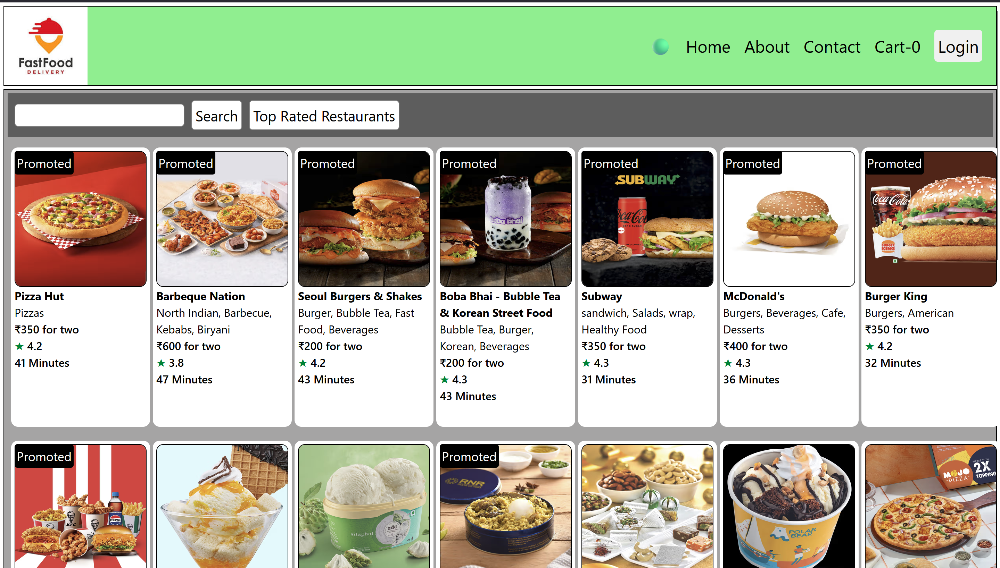
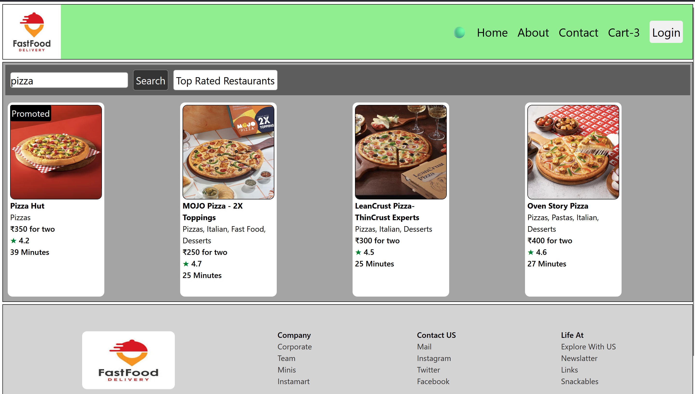
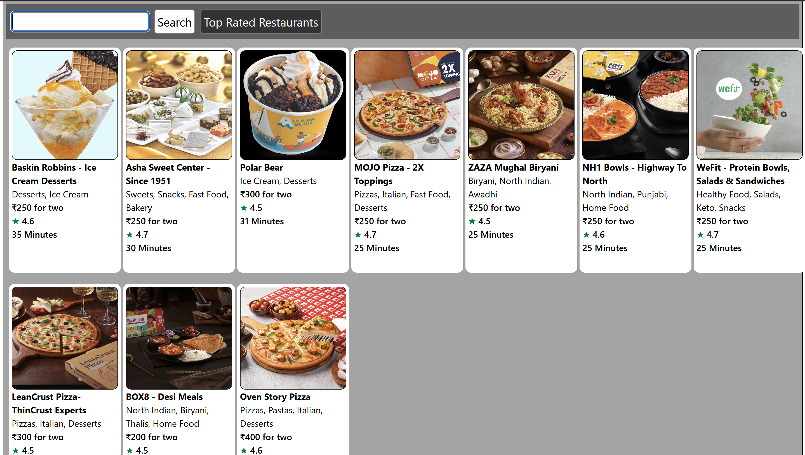
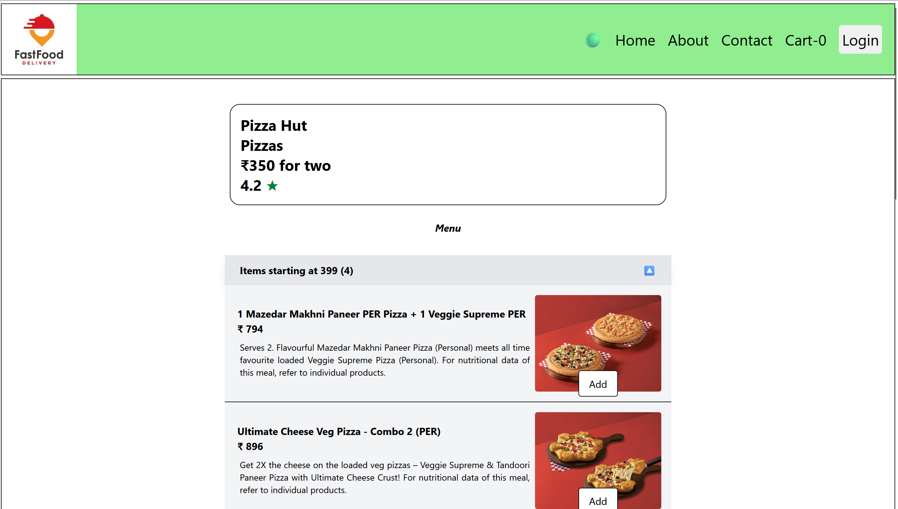
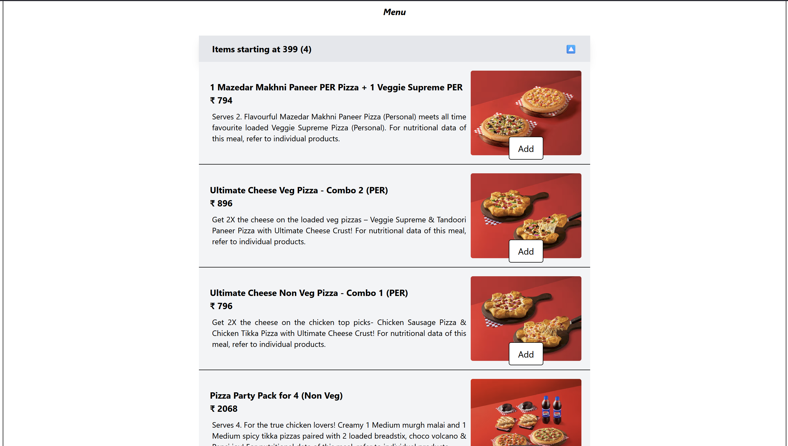
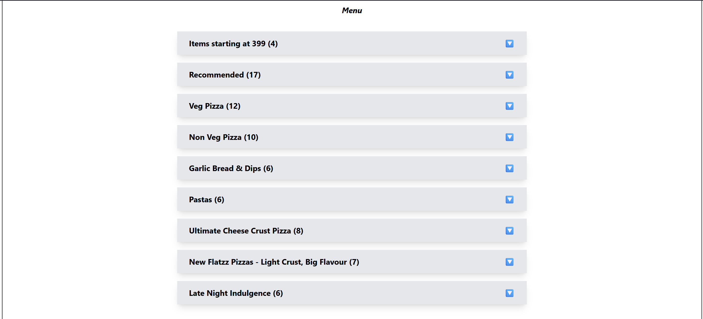
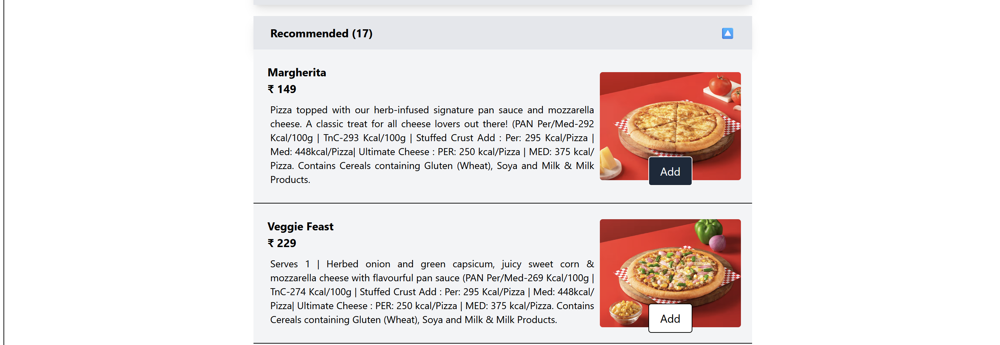
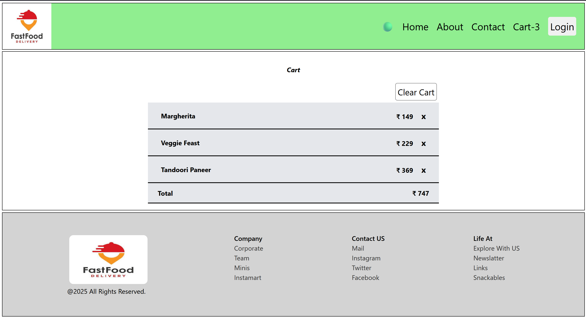
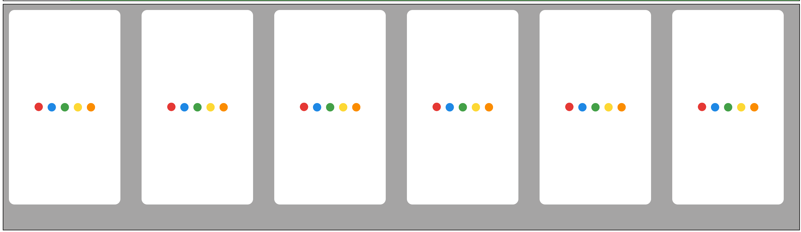

# 🍔 Food App

A **food ordering web application inspired by Swiggy**, built with **React.js**, **Redux**, **Tailwind CSS**, and **Parcel**.

This project was created to practice building a real-world food delivery interface with reusable React components, state management, responsive design, and dynamic restaurant data.

## 🚀 Features

* 🏠 Home page with restaurant listings
* 🍽️ Restaurant cards with ratings, cuisines, and delivery information
* 🔍 Search restaurants
* 🔍 Get top restaurants
* 📋 Restaurant menu
* 🛒 Add food items to cart
* 🗑️ Remove items from cart
* 💰 Dynamic cart total
* ⚡ Redux for state management
* 📱 Responsive design
* 🎨 Tailwind CSS styling
* 🧩 Reusable React components

## 🛠️ Technologies Used

* **React.js**
* **Redux**
* **JavaScript**
* **Tailwind CSS**
* **HTML5**
* **CSS3**
* **Parcel**

## 📸 Preview

### 🏠 Home Page


### 🍽️ Search Restaurant


### 📋 Top Restaurant


### 📋 Restaurant Page


### 📋 Restaurant Menu


### 📋 Items Category


### 📋 Items Category


### 🛒 Cart


### 🛒 Shimmer



## ⚙️ Installation

Clone the repository:

```bash
git clone https://github.com/singhtevsan/food-app-react.git
```

Navigate to the project directory:

```bash
cd food-app-react
```

Install dependencies:

```bash
npm install
```

Start the development server:

```bash
npm start
```

Open the local development URL in your browser.

## 📁 Project Structure

```text
src/
├── components/
├── utils/
├── store/
├── App.js
├── index.js
└── ...
```


## 🧠 Redux State Management

Redux is used to manage application-wide state, particularly the shopping cart.

The cart functionality includes:

* Adding items
* Removing items
* Updating item quantities
* Calculating the total price

This helped me understand how global state can be managed and shared between different React components.


## 🎯 Purpose

This project was built as a learning project to improve my understanding of:

* React component architecture
* Redux state management
* React hooks
* Reusable components
* Dynamic rendering
* Responsive UI development
* Tailwind CSS
* Parcel bundling
* Building real-world frontend applications

## 🔮 Future Improvements

* 🔐 User authentication
* 💳 Online payment integration
* 📍 Location-based restaurant search
* 🛵 Order tracking
* 📜 Order history
* ❤️ Favorite restaurants
* ⭐ Restaurant reviews and ratings
* 🔔 Order notifications
* 🌙 Dark mode

## 👨‍💻 Author

**Sandeep Singh**

If you found this project useful or interesting, feel free to ⭐ the repository!

## 🔗 Repository

[Food App React — GitHub](https://github.com/singhtevsan/food-app-react)
